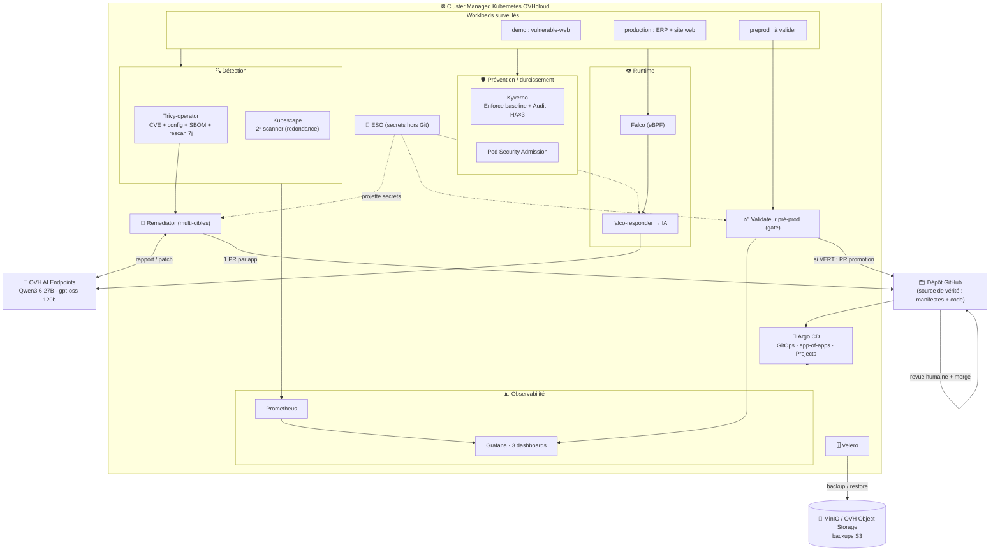

# Hackathon OVHcloud × Lille Ynov Campus — Équipe 13
## Chaîne d'audit & de remédiation GitOps sécurisée sur Kubernetes

> **La boucle cible :** détection d'une faille → analyse & correctif proposé par l'**IA** → **Pull Request automatique** sur Git → revue humaine → merge → **resynchronisation Argo CD** → cluster corrigé → **prévention de la récidive**.

L'IA (OVH AI Endpoints) n'est pas un assistant : c'est un **composant actif** de la chaîne — le moteur qui transforme un rapport de vulnérabilité en correctif prêt à relire.

> 🧠 **Idée directrice** — l'IA patche l'**état désiré dans Git**, jamais le cluster en direct. Git est la source de vérité, Argo CD réconcilie. La **revue humaine avant merge** est le garde-fou anti-correctif cassé/empoisonné.

---

## 🏛️ Architecture (vue d'ensemble)



---

## 🧩 Ce qui est en place (récapitulatif)

### Le cœur — boucle audit → remédiation IA
- **Trivy-operator** : scan CVE + config, **SBOM CycloneDX**, **rescan planifié tous les 7 j** (indépendant des déploiements), métriques Prometheus.
- **Remediator (notre code)** : CronJob in-cluster **multi-cibles** — lit les rapports Trivy par workload → OVH AI (`Qwen3.6-27B`) → manifeste corrigé validé → **une Pull Request par application** (`vulnerable-web`, `ERP`, `site web`).
- **Argo CD** : GitOps app-of-apps ; le merge d'une PR → resync → cluster corrigé.

### Prévention & durcissement (anti-escalade)
- **Kyverno** : baseline **Enforce** (privileged / hostPath / host-namespaces, exceptions infra) + policies **Audit** ; **HA ×3** + PDB (SPOF du webhook éliminé).
- **Pod Security Admission** `restricted` (enforce sur nos composants, warn sur les sandboxes).
- **Argo Projects** (dépôts + namespaces approuvés), **NetworkPolicies**, **RBAC lecture seule**, `automountServiceAccountToken: false`.
- **Kubescape** : 2ᵉ scanner indépendant (défense en profondeur détection).

### Runtime & observabilité
- **Falco** (eBPF) → **falco-responder** : sur alerte, l'IA (`gpt-oss-120b`) analyse l'incident → issue / fichier d'incident GitHub.
- **Prometheus + Grafana**, **3 dashboards** : CVE & remédiation · Gouvernance & GitOps (Kyverno + Argo CD) · Validation pré-prod.

### Environnements & qualité
- **Pré-prod** + **validateur** : teste le correctif (santé, smoke, CVE, policies) → **rapport Grafana** + **gate de promotion** (rien n'atteint la prod sans passer le sas).
- **Multi-cluster** (branche `feat/multi-cluster`) : promotion pré-prod→prod + ApplicationSet miroir (prêt à activer).

### Résilience & secrets
- **Velero → MinIO / OVH Object Storage** : backup + restore de l'état runtime et des PV (**PRA** prouvé). Endpoint S3 swappable (anti lock-in).
- **ESO** : token GitHub + clé IA projetés depuis un store, **jamais dans Git**.

---

## 🚨 Risques que cette structure réduit

| Risque | Mesure dans l'architecture |
|---|---|
| **CVE non corrigées** | Détection continue (Trivy + Kubescape) → remédiation IA → PR → correction |
| **Nouvelles CVE sur images inchangées** | **Scan Trivy planifié** (rescan 7 j, indépendant de tout déploiement) |
| **Dérive de configuration (drift)** | GitOps Argo CD `selfHeal` — le cluster = reflet exact de Git |
| **Correctif cassé/empoisonné en prod** | **Revue humaine** avant merge + **sas de validation pré-prod** (gate mesuré) |
| **Évasion conteneur → nœud** (« machine haute ») | **PSA restricted** + **Kyverno Enforce** (privileged / hostPath / host-namespaces) |
| **Mauvaises configs** (root, no-limits, `:latest`) | Kyverno + Trivy config audit + PSA |
| **Compromission d'un composant (blast radius)** | RBAC lecture seule · NetworkPolicies · **Argo Projects** · moindre privilège |
| **Secrets exposés dans Git** | **ESO** — secrets hors Git, projetés à la demande |
| **Menace runtime** (shell, reconnaissance, `/etc/shadow`) | **Falco** (eBPF) → analyse IA → incident tracé |
| **SPOF** (webhook d'admission) | **HA Kyverno ×3** + PDB + anti-affinité |
| **Perte de données / du cluster** | **Velero** backup/restore (PRA) → S3 (MinIO / OVH Object Storage) |
| **Supply chain (images)** | SBOM CycloneDX + 2 scanners *(roadmap : Harbor managé + cosign)* |
| **Absence de traçabilité** | Métriques Grafana · PolicyReports · PR/issues GitHub horodatées |
| **Vendor lock-in** | 100 % **CNCF** + K8s standard ; IA & S3 via API standard (swappable) |

---

## 🧱 Stack (statut CNCF)

| Composant | Rôle | Statut CNCF | Licence |
|---|---|---|---|
| **Argo CD** | GitOps | Graduated | Apache-2.0 |
| **Trivy-operator** | Scan CVE + config + SBOM | Aqua Security (validé CNCF) | Apache-2.0 |
| **Kubescape** | 2ᵉ scanner (CVE + conformité) | Sandbox→Incubating | Apache-2.0 |
| **Kyverno** | Policy-as-code | Graduated | Apache-2.0 |
| **Falco** | Détection runtime (eBPF) | Graduated | Apache-2.0 |
| **Prometheus** (+ Grafana) | Observabilité | Graduated | Apache-2.0 (Grafana : AGPL-3.0) |
| **External Secrets Operator** | Secrets hors Git | Incubating | Apache-2.0 |
| **Velero** | Sauvegarde / restauration | (Velero) | Apache-2.0 |
| **OVH AI Endpoints** | Couche IA générative | — (OVHcloud) | service |

---

## 🗂️ Structure du dépôt

```
.
├── root-app.yaml              # app-of-apps : bootstrap toute la plateforme
├── infra/argocd-apps/         # une Application Argo CD par brique (+ AppProject)
├── apps/
│   ├── vulnerable-app/        # workload de démo (cible de la boucle)
│   ├── production/            # ERP + site web (surveillés)
│   ├── preprod/               # environnement pré-prod (validé avant promotion)
│   ├── remediator/            # couche IA de remédiation (code + k8s)
│   ├── falco-responder/       # Falco → IA → incident GitHub
│   ├── validator/             # sas de validation pré-prod (métriques Grafana)
│   ├── observability/         # dashboards Grafana + ServiceMonitors
│   └── backup/                # MinIO (cible S3 des backups Velero)
├── policies/                  # ClusterPolicies Kyverno (Audit + Enforce)
├── envs/                      # (branche) multi-cluster : preprod / prod + miroir
├── scripts/                   # bootstrap des secrets (hors Git)
├── docs/                      # rapport d'architecture + tableau CNCF
└── secrets/                   # kubeconfig + clés (JAMAIS commit — .gitignore)
```

---

## 🚀 Démarrage

> **Règle d'or GitOps** : après Argo CD, plus rien ne s'installe à la main — tout passe par un commit.

```bash
export KUBECONFIG=$PWD/secrets/kubeconfig-equipe-13.yaml
# 1. Argo CD (seule étape manuelle)
kubectl create namespace argocd
kubectl apply -n argocd -f https://raw.githubusercontent.com/argoproj/argo-cd/stable/manifests/install.yaml
# 2. Secrets hors Git (token GitHub, clé IA, MinIO)
bash scripts/bootstrap-secrets.sh && bash scripts/bootstrap-backup.sh
# 3. Bootstrap : app racine → déploie toute la plateforme depuis Git
kubectl apply -f root-app.yaml
```

Interfaces : `kubectl port-forward svc/argocd-server -n argocd 8080:443` · `svc/monitoring-grafana -n monitoring 3000:80`.

---

*Équipe 13 — Hackathon Lille Ynov Campus × OVHcloud, 6–7 juillet 2026.*
